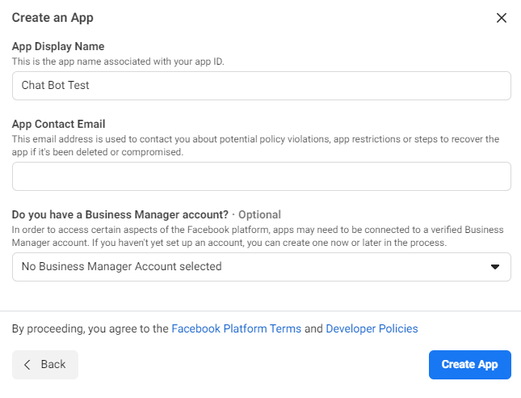

## Creating a Facebook Messenger Chat Bot using PHP

Facebook Messenger Platform allows for creation of dynamic chat bots that can build customer relationships through conversation. In this tutorial, we will explore creating 
a simple Facebook Messenger Chat Bot using a PHP backend for processing.

## Requirements of this Tutorial
- Access to Facebook
- Knowledge and understanding of PHP
- Access to a PHP host online

## Step 1. Creating a Facebook App
In order to create a Facebook Messenger Chat Bot, you would first need to create a facebook app. First you would need to visit the link below and log in and create an app:
- [https://developers.facebook.com/](https://developers.facebook.com/)

Once selected, you would need to give this app a display name as shown below:
