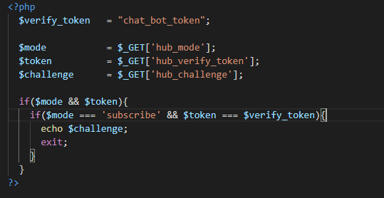
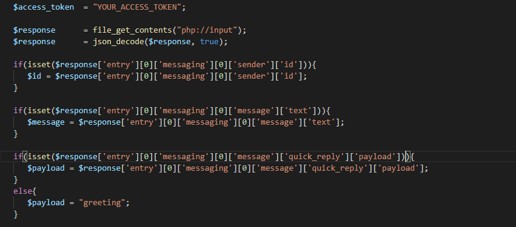
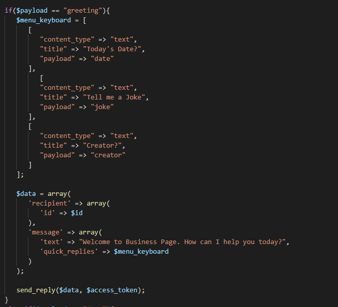
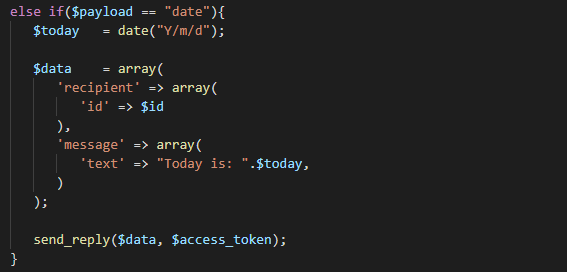
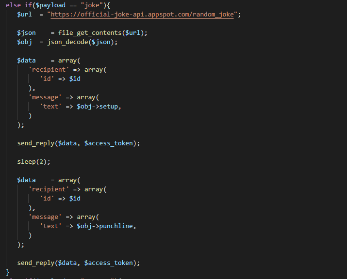
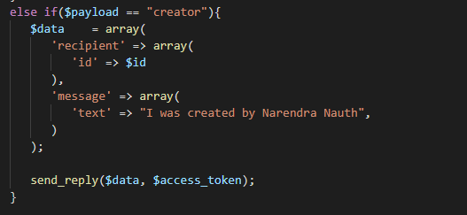
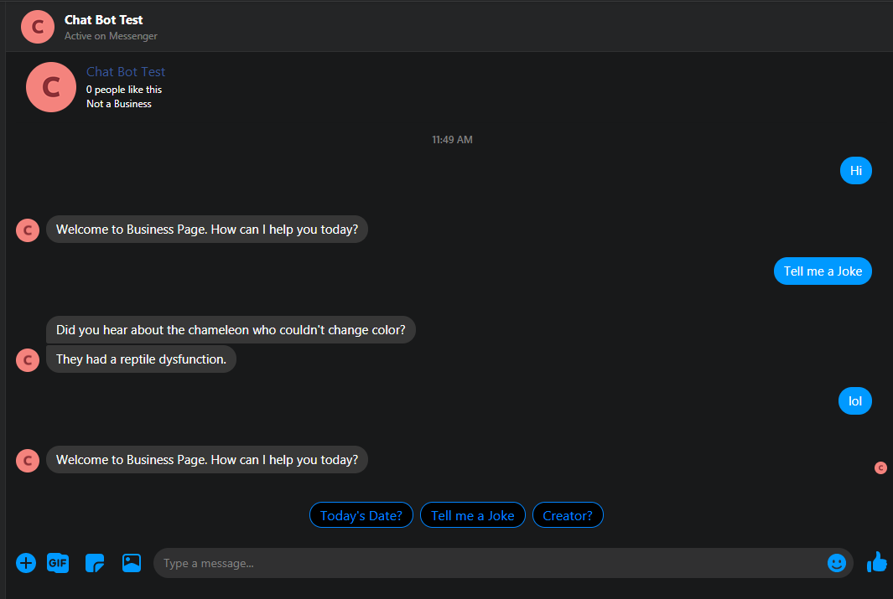

## Creating a Facebook Messenger Chat Bot using PHP

Facebook Messenger Platform allows for creation of dynamic chat bots that can build customer relationships through conversation. In this tutorial, we will explore creating 
a simple Facebook Messenger Chat Bot using a PHP backend for processing.

## Requirements of this Tutorial
- Access to Facebook
- Knowledge and understanding of PHP
- Access to a PHP host online

## Step 1. Creating a Facebook App
In order to create a Facebook Messenger Chat Bot, you would first need to create a facebook app. First you would need to visit the link below and log in and create an app:
- [https://developers.facebook.com/](https://developers.facebook.com/)

Once selected, you would need to give this app a display name as shown below:

## Step 2. Setting up Messenger & Webhooks
You would now need to add and set up the Messenger and Webhooks products. Click Products plus icon on the left menu and under "Messenger" click "Set Up" as shown below:

For Webhooks you would need to start doing some programming. First you will need to setup a webhook file on the online host. 
Facebook will need to verify that you have access to the server for which the Webhook will point to. For this verification the following will be sent using a GET request:
- hub_mode
- hub_verify_token
- hub_challenge

You will create a PHP file to collect these variables, check whether the hub_mode is "subscribe" and the hub_verify_token is the one supplied. Once accepted, you will print the hub_challenge as shown below:

After which, visit back your Facebook App and select Products. Under "Webhooks" click "Set Up" and you will then need to click the button "Subscribe to this object". You will be prompted to enter the following as shown below:

Enter the following as requested:
- Callback URL: URL to your online host where your webhook PHP file resides
- Verify Token: Token string that you will use to verify same as what was set in the webhook PHP file

Once completed click "Verify and Save" and it will be verified.

## Step 3. Page, Subscription & Access Token
In this step, you will need to have the necessary subscription and access tokens set up for processing of messages. First go to the Facebook App you would have created.
Under Products go to Messenger Settings. Under "Access Tokens" click "Add or Remove Pages". You will then be prompted to select a page to use this Chat Bot. If you do not
have a page created, you can have one done and then repeat this process, else select your desired page. 

Under "Webhooks" you will also need to add a subscription by clicking the "Add Subscription" button. From the list provided, select "messages" as shown below:

Lastly under "Access Tokens" click on the button "Generate Token" and copy your token as shown below:

This will be required in order to process messages on your server.

## Step 4. Programming the Message Backend
In this step we will be creating the backend for processing of all messages sent through the Chat Bot. First you would need to have the necessary message data collected. We achieve this by collecting the JSON formatted response sent and extracting the id, message & payload as shown below:

Next we check the payload to determine the current message request. If not set, we default the to greeting message. We first check to see if the payload is set as greeting and we provide a menu for the user to select from the sample prompts as shown below:

The menu system in this tutorial provides the following options:
- Today's Date?
- Tell me a Joke
- Creator?

If the user selects "Today's Date?", the system checks what is the current date using PHP date function and provides that as a response as shown below:

If the user selects "Tell me a Joke", the system uses a free online API to generate a random joke and provides the joke setup, waits for a couple of seconds, then provides the punchline in a separate message as shown below:

Lastly if the user selects "Creator?", the system provides the name of the creator for this project as shown below:

All of these messages are sent using PHP CURL requests which sends the nesessary data to the Facebook Graph API using the access_token for verification as shown below:

## Step 5. Testing & Moving to Production
Once completed you would then be able to test this Chat Bot using the page selected earlier as shown below:

After you would have finished testing and verifying your Chat Bot is complete, you can then go to the Facebook App and move the slider from "Development" to "Production".